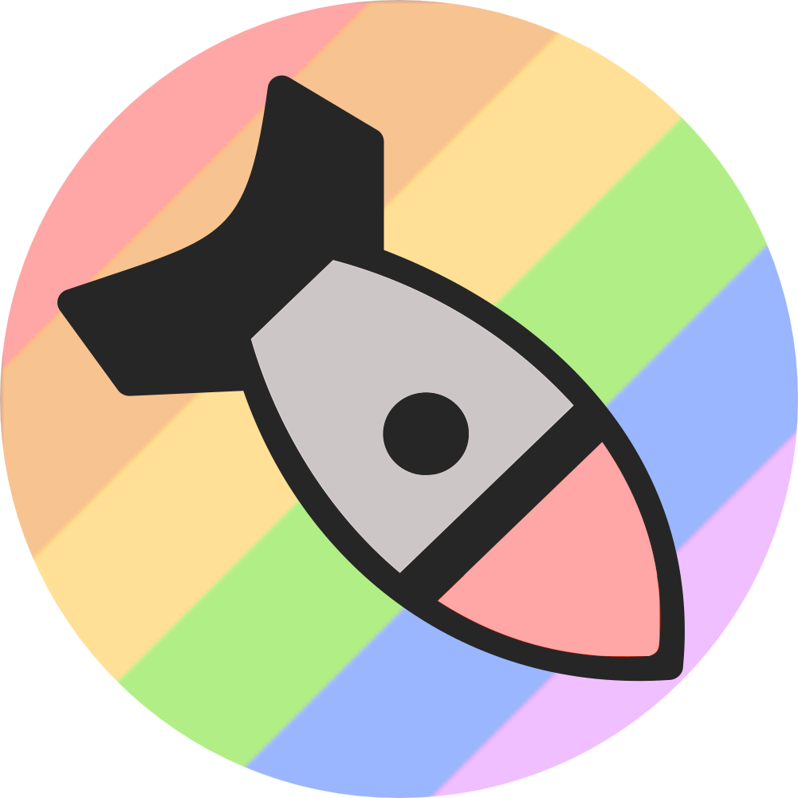
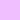
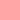
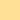
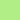

<h3 align="center">
   
  Softie Theme
</h3>

<h6 align="center">
  <a href="https://github.com/dpv927/softie-theme#-palette">Palette</a>
  ·
  <a href="https://github.com/dpv927/softie-theme#-showcase">Showcase</a>
  ·
  <a href="https://github.com/dpv927/softie-theme#-availability">Availability</a>
  ·
  <a href="https://github.com/dpv927/softie-theme#-license">License</a>
</h6>

  

	
	
	
	

 

Softie theme is a color scheme designed to take care of your eyes. Typically, we choose dark themes when developing code or spending hours in front of the screen, but we miss having a color scheme that is eye-catching (but not overly so), beautiful, simple, pleasing to the eye, and above all, one that we don't get tired of. That's why I (<a href="https://github.com/dpv927">@dpv027</a>) created a color theme inspired by <a href="https://github.com/topics/one-dark">Atom OneDark</a>, <a href="https://github.com/catppuccin">Catppuccin</a>, and <a href="https://nvchad.com/themes">Aquarium theme from NvChad</a>. In this repository, you can find a variety of guides to apply this theme to your applications.

 

### Palette

| Palette      | Hex       | RGB           | HSL             |  |
| ------------ | --------- | ------------- | --------------- | ------------------------------------------------- 
| Background   | `#292932` | ` 41  41  50` | `240°  10%  18%` |    |
| Current Line | `#31313a` | ` 49  49  58` | `240°   8%  21%` |  |
| Selection    | `#363c41` | ` 54  60  65` | `207°   9%  23%` |    |
| Foreground   | `#cbc6c6` | ` 54  60  65` | `  0°   5%  79%` |    |
| Comment      | `#7f848e` | `127 132 142` | `220°   6%  53%` |      |
| Purple       | `#f0bfff` | `240 191 255` | `286° 100%  87%` |       |
| Red          | `#ffa6a6` | `255 166 166` | `  0° 100%  83%` |          |
| Orange       | `#f7c390` | `247 195 144` | ` 30°  87%  77%` |       |
| Yellow       | `#ffe096` | `255 224 150` | ` 42° 100%  79%` |       |
| Blue         | `#99b6ff` | `153 182 255` | `223° 100%  80%` |         |
| Cyan         | `#88c9de` | `136 201 222` | `195°  57%  70%` |         |
| Green        | `#b1ee86` | `177 238 134` | ` 95°  75%  73%`  |       |

 

### Availability

The theme is (officially) availabe in the next applications:

- <a href="https://github.com/dpv927/softie-theme/tree/main/vscode">Visual Studio Code<a>
- <a href="https://github.com/dpv927/softie-theme/tree/main/alacritty">Alacritty</a>
- <a href="https://github.com/dpv927/softie-theme/tree/main/eclipse-dev-style">Eclipse</a>

 

### Contributing
> **Note**  
> If you would like to submit or suggest a change for any application theme, please contact me.
> Contributions are greatly appreciated, as there are numerous applications out there, and it's almost impossible to cover all of them, especially without any errors.

 

### License

This project is under the [MIT license](LICENSE).
