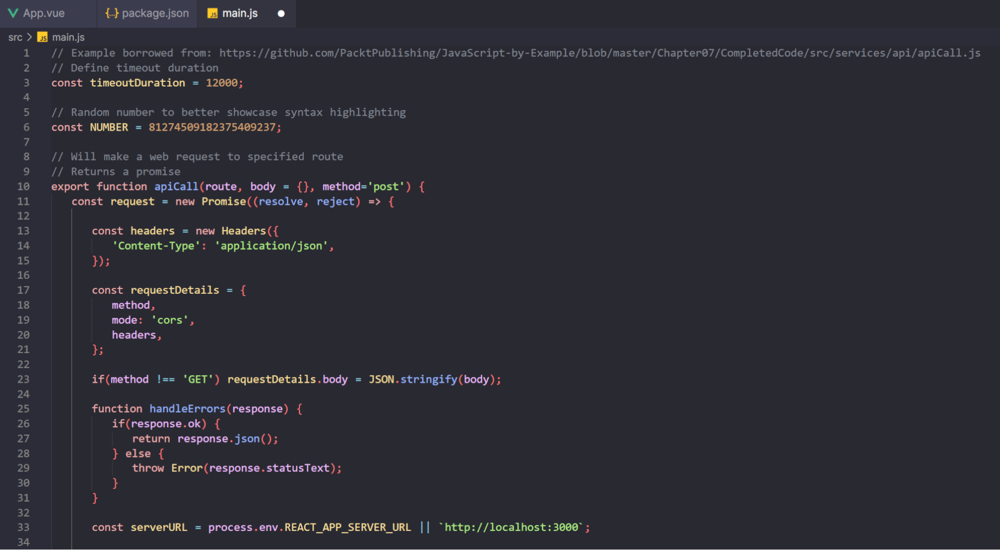

<div class="logo" align="center">
  
</div>

<h1 class="title" align="center">
  Softie Colour Theme
  <br>
</h1>

<div class="description" align="center">
  <p>A dark and soft theme designed to maintain the health of your eyes.</p>
</div>

<div class="badges" align="center">
  
  
  
  
  
  
</div>

<div class="shortcuts" align="center">
  <a href="#about">About</a> •
  <a href="#download">Download</a> •
  <a href="#related">Related</a> •
  <a href="#credits">Credits</a> •
  <a href="#license">License</a>
</div>

<br>

<div class="preview" align="center">
  
</div>

## About

*Softie* is a soft-colored theme with a dark tone, especially designed for text editors. It has a similar appearance to pastel colors but with more vibrant, beautiful, and pleasant shades.

Why should you use Softie for your text editor? Well, as mentioned before, this is a dark theme, which is more pleasant to the eyes than a white or light background. Moreover, the other colors in the palette are prominent enough to provide clear syntax highlighting without being too distracting.

The color palette is the next one:

| <br/><b>``#fb7676``</b><br/> | <br/><b>``#b1ee86``</b><br/> | <br/><b>``#fbe09f``</b><br/> | <br/><b>``#99b6ff``</b><br/> | <br/><b>``#f0bfff``</b><br/> |
| --- | --- | --- | --- | --- |
| <p align="center"><br/><b>``#f0afaf``</b><br/></p> | <p align="center"><br/><b>``#d4a373``</b><br/></p> | <p align="center"><br/><b>``#88c9de``</b><br/></p> | <p align="center"><br/><b>``#7f848e``</b><br/></p> | <p align="center"><br/><b>``#292932``</b><br/></p> |

## Download

The color theme is currently available for [VSCode](https://code.visualstudio.com/), but you can apply it to any other platform using the colors from the palette. That being said, you can install the VSCode extension from [this website](https://marketplace.visualstudio.com/items?itemName=filipondios.softie-theme) or directly from the extensions section in VSCode.

Alternatively, you can fork this repository and clone it to contribute to its development:
```bash
git clone https://github.com/your_user_name/softie-theme
cd softie-theme
# ... make your changes
git commit -m "commit message" && git push
```
Afterward, open a pull request to this repository. Your contributions will be reviewed and appreciated if they follow the philosophy of this color theme.

## Related

In my other account, I have some additional color themes for the Eclipse 'Dev-Style' plugin, which are some based on popular themes on the internet, and others that are my own creations. If you have any theme that you would like to be implemented for this plugin, simply contact me or open an issue in that repository. [Here is the link](https://github.com/Filipondios/Eclipse-Dev-Style-Themes).

## Credits

The theme has been inspired by other popular themes for text editors. Here are the references:

- [Electron: Onedark theme](https://github.com/topics/one-dark)
- [NvChad: Aquarium theme](https://nvchad.com/themes/themelist)
- [Catppuccin: catppuccin theme](https://github.com/catppuccin/catppuccin)

## License

This project is under the [MIT license](LICENSE).
