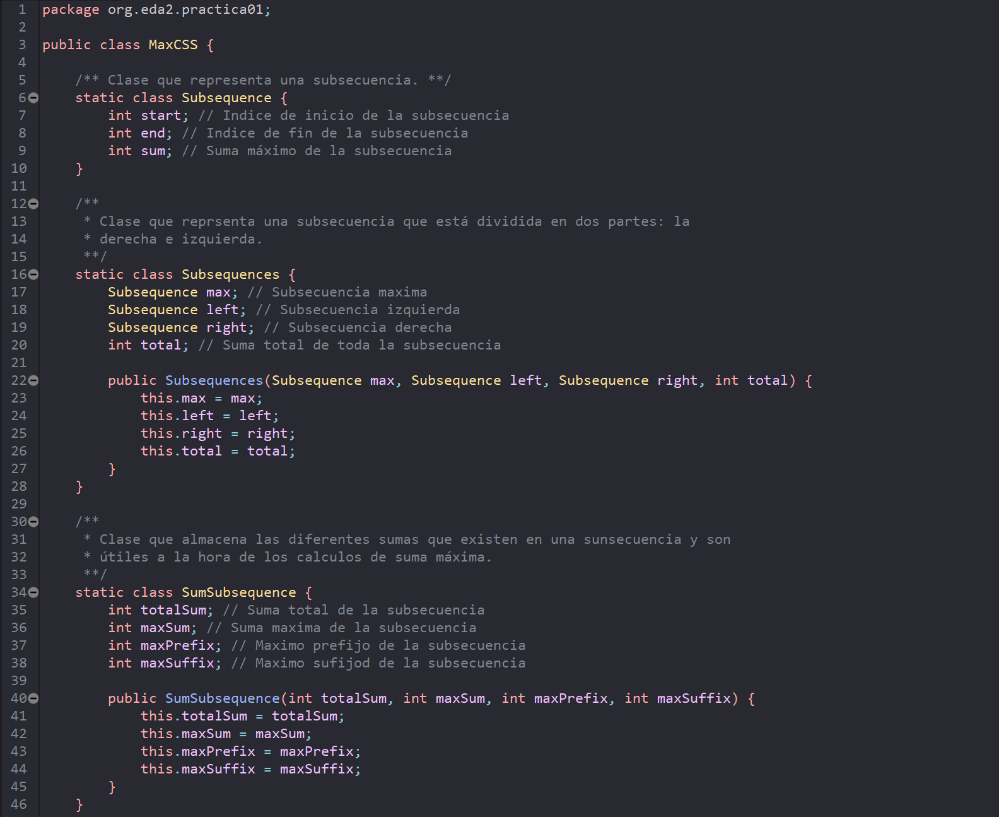

<h1 class="title" align="center">
  Softie Colour Theme for Eclipse
   
</h1>

  
A dark and soft theme designed to maintain the health of your eyes while using Eclipse.

 

  

## Install
The colorscheme is stored at the `softie.xml` file. You need to import the code from that file to Eclipse. To do so, first, you will need to install the `Eclipse Dev-Style` plugin. You can search this plugin at `Help -> Eclipse Marketplace` and searching for 'darkest theme' or 'dev-style'. 

Then, you must restart Eclipse and go to `Window -> Prefferences -> DevStyle -> Color Themes`, switch the workbench theme to `Dark Custom`, import the `.xml` file that you downloaded and enable `theme background`. Finally change the H, S and L values to this ones: `240, 10, 18`.