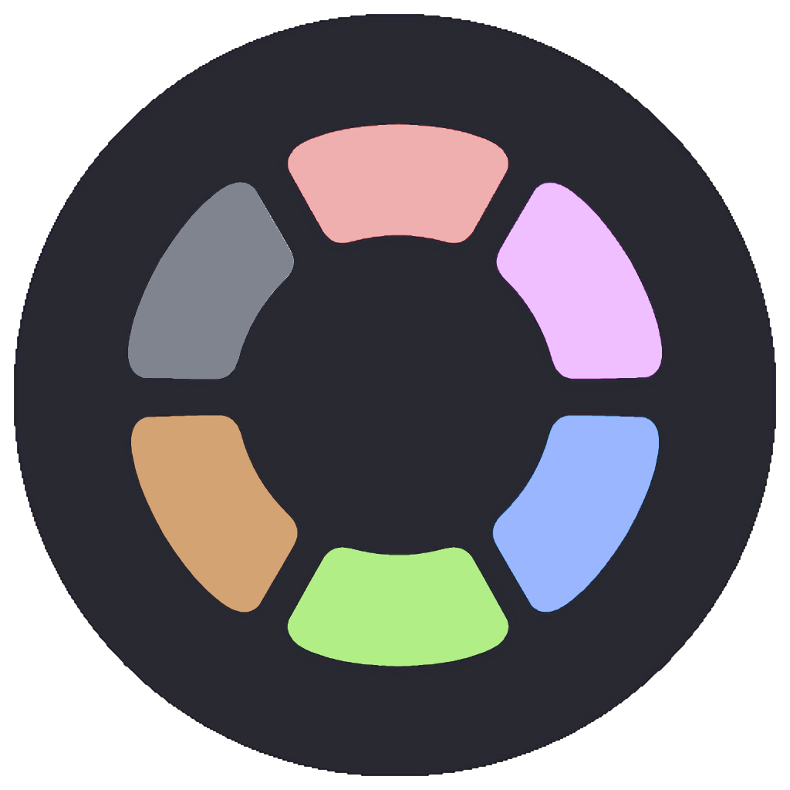

  

<h1 class="title" align="center">
  Softie Colour Theme
   
</h1>

  
A dark and soft theme designed to maintain the health of your eyes at VsCode.

  
  
  
  
  
  

  <a href="#about">About</a> •
  <a href="#credits">Credits</a> •
  <a href="#license">License</a>

 

  

## Download

The color theme for [VSCode](https://code.visualstudio.com/) is currently available at the official [Visual Studio website](https://marketplace.visualstudio.com/items?itemName=filipondios.softie-theme) or directly from the extensions section in VSCode, where you can search it as `softie-theme` or `softie dpv927`. 

## License

This project is under the [MIT license](LICENSE).
